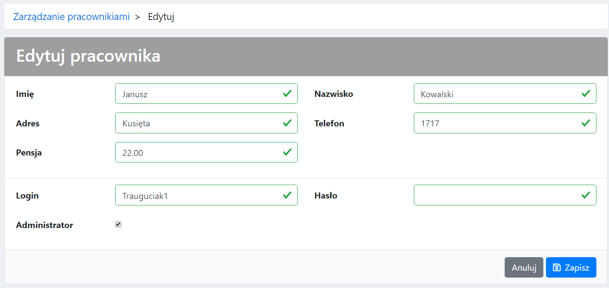
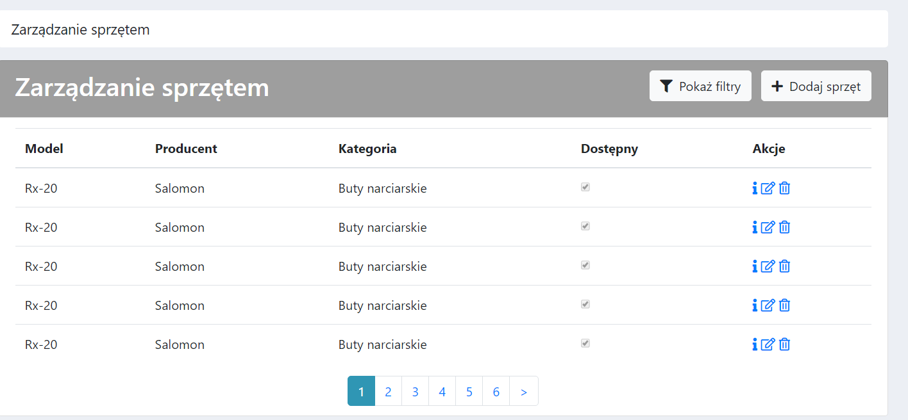
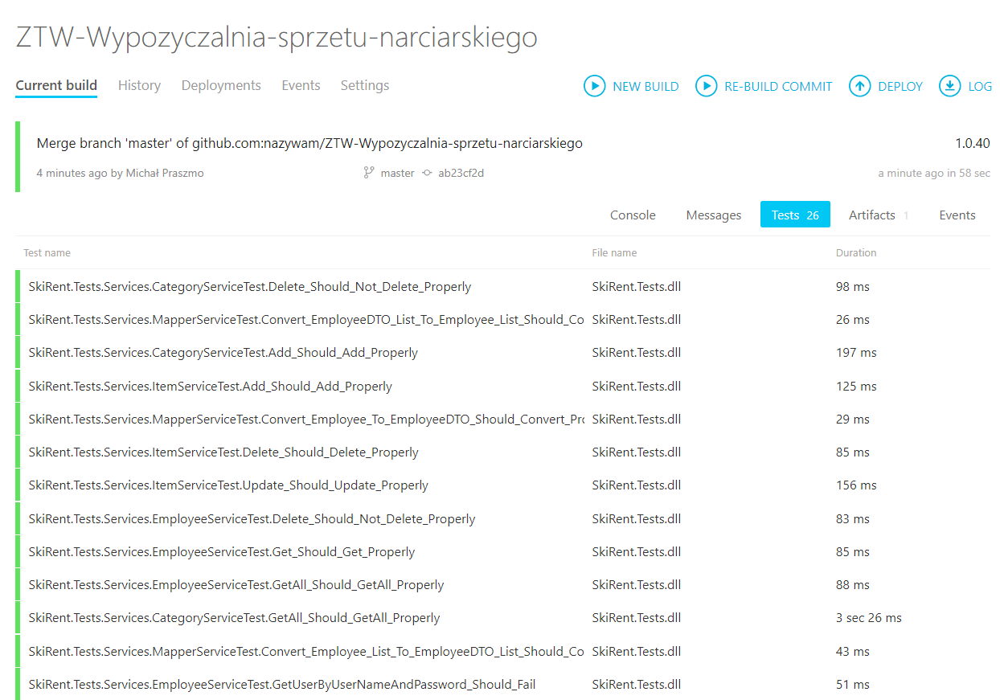

# SkiRent

# Requirements

 * Visual Studio 2017 (including .NET framework)
 * `MySQL Connector Net 6.9.10` from [here](https://dev.mysql.com/downloads/connector/net/6.9.html), add references

# Building

## Database

 * Setup a MySQL database
 * Create a database and a user
 * Generate the database structure from `/Misc/db.sql`
 * Correct the databse connection string in `/SkiRent/SkiRent/Web.config`

## Application
 * Open the solution file(`SkiRent.sln`) in Visual Studio, build the project and navigate to http://localhost:49698/

# Features

## Logging in

## Employee management

### Browsing

### CRUD

## Inventory management

### Browsing

## Build status

[Current Build](http://skirent-env.qmgk85mipb.eu-central-1.elasticbeanstalk.com/)

