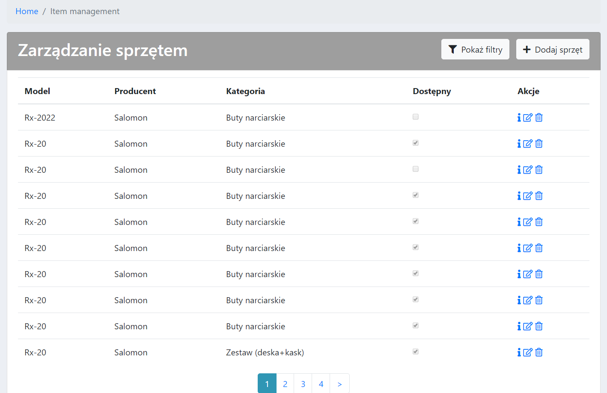
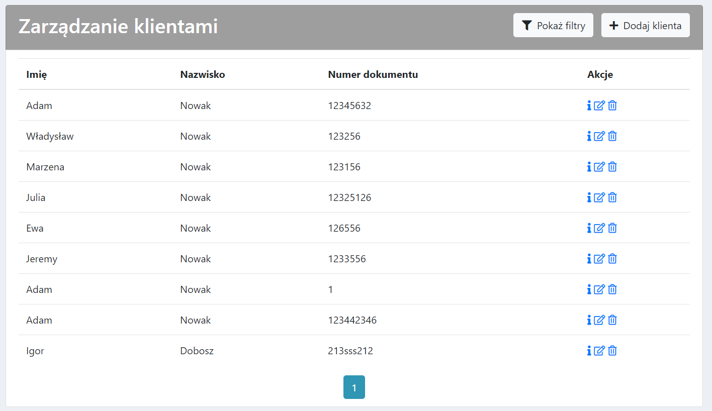
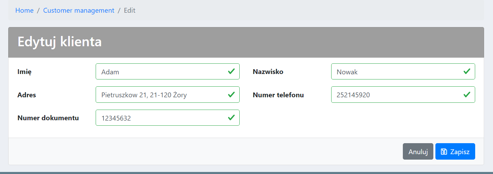
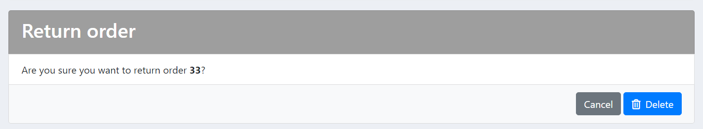
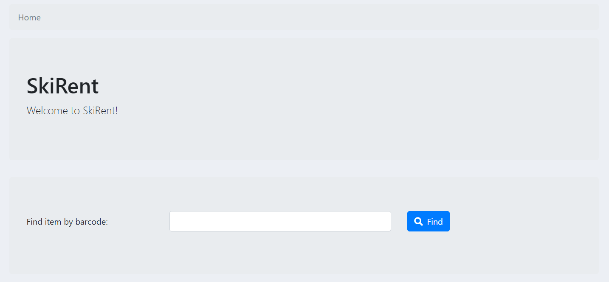
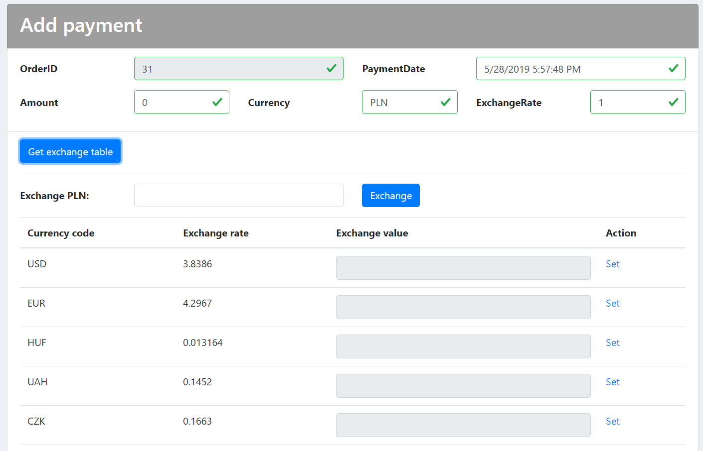
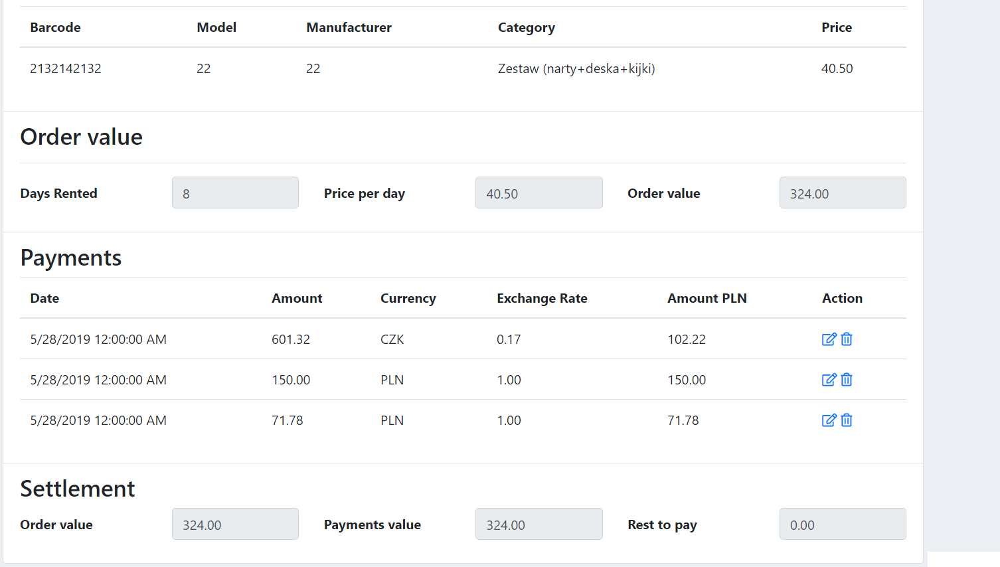
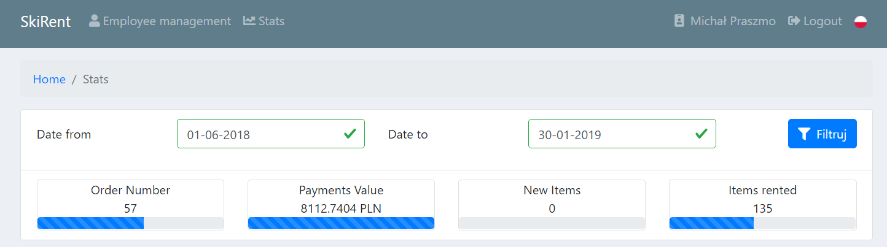

# SkiRent

# Content

 * [Deployment](#Deployment)
 * [Requirements](#Requirements)
 * [Building](#Building)
 * [Misc](#Misc)
 * [Features](#Features)
   * [Logging in](#Logging-in)
   * [Employee management](#Employee-management)
   * [Inventory management](#Inventory-management)
   * [Clients management](#Clients-management)
   * [Orders managamenet](#Orders-managamenet)
   * [Fast barcode scanning](#Fast-barcode-scanning)
   * [Return form](#Return-form)
   * [Order payment in various currencies](#Order-payment-in-various-currencies)
   * [Build status](#Build-status)
   * [Stats](#Stats)

# Deployment
  * [Current deployment](http://skirent-pwr.azurewebsites.net)

# Requirements

 * Visual Studio 2017 (including .NET framework)
 * `MySQL Connector Net 6.9.10` from [here](https://dev.mysql.com/downloads/connector/net/6.9.html), add references

# Building

## Database

 * Setup a MySQL database
 * Create a database and a user
 * Generate the database structure from `/Misc/db.sql`
 * Correct the databse connection string in `/SkiRent/SkiRent/Web.config`

## Application
 * Open the solution file(`SkiRent.sln`) in Visual Studio, build the project and navigate to http://localhost:49698/

# Misc
 * 🇵🇱/🇬🇧 lang
 * The application uses public api from nbp: http://api.nbp.pl/api/exchangerates/tables/A/ to calculate payment values for various currencies

# Features

## Logging in

## Employee management

### Browsing

### CRUD

## Inventory management

### Browsing

### CRUD

## Clients management

### CRUD

## Orders managamenet

### CRUD

## Return form

## Fast barcode scanning

## Order payment in various currencies

## Stats

## Build status

